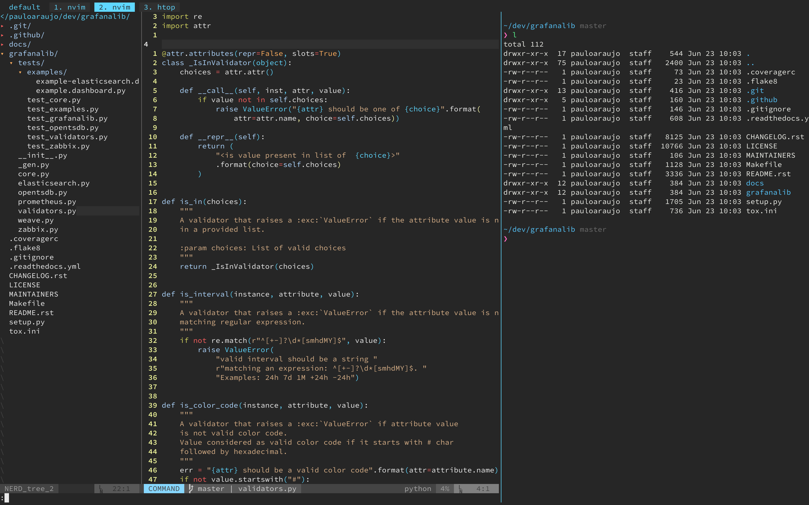

# dotfiles

My dotfiles, based on the 3 things I value the most when working on the terminal:

- Editing capabilities
- Accesibility
- Performance

These are not setup to cover everyone's needs. In fact, they relate to my current work and change every other week.

If you like what you see and plan on using it, please first take a look at the settings themselves, since you'll be using them at your own risk.

## Overview

The aim is for the workspace to be simple enough that's not full of cluter but still shows everything I need to see at any given time.

- Terminal: [Kitty](https://sw.kovidgoyal.net/kitty/) + [Tmux](https://github.com/tmux/tmux)
    - Theme: [Nord](https://github.com/arcticicestudio/nord)
    - Shell: [Zsh](https://wiki.archlinux.org/index.php/zsh) + [Zgen](https://github.com/tarjoilija/zgen)
    - Font: [Source Code Pro for Powerline](https://github.com/powerline/fonts/tree/master/SourceCodePro)
- Editor: [Nvim](https://neovim.io/)

### Editing (todo)

### Accesibility (todo)

- [Better Touch Tool](https://folivora.ai/): When working on my macbook Pro I felt some accessibility issues which MacOS does not easily allow to configure. I use BTT to standardize how I move around the OS, so I can move on the same manner I move around the terminal and text editor.

### Performance (todo)

### Other (todo)

## Installation

Currently using [Gnu Stow](https://www.gnu.org/software/stow/) to manage the files, inspired by [Brandon Invergo's post](http://brandon.invergo.net/news/2012-05-26-using-gnu-stow-to-manage-your-dotfiles.html).

**Using stow with home as the target dir**

`stow -t ~/ [package-name]` to install package

`stow -D -t ~/ [package-name]` to remove package symlinks

`stow -R -t ~/ [package-name]` to restow/refresh package symlinks

Non-stowable packages are suffixed with `*-config`.

### Using Brew

**Create Brewfile in the current directory**

`brew bundle dump`

**Install everything from the Brewfile**

`brew bundle`

_Note:_ Check `brew bundle -h` for further info.

### Using npm

**Get all user-installed packages into a file**

`npm list -g --depth=0 > npm-packages`

### Plugging nvim

- Open nvim after stowing the package and call `PlugInstall` (and `PlugClean` first if necessary).

## Todo

- [ ] Finish README
- [ ] Install scripts + Makefile
- [ ] Sublime Text config
- [ ] Improve where files are localed (symlinked into). Most of the files are sourced according to a root env var anyway, so maybe we can come up with some kind of organization.
- [ ] Document my choices for shell optimisation
